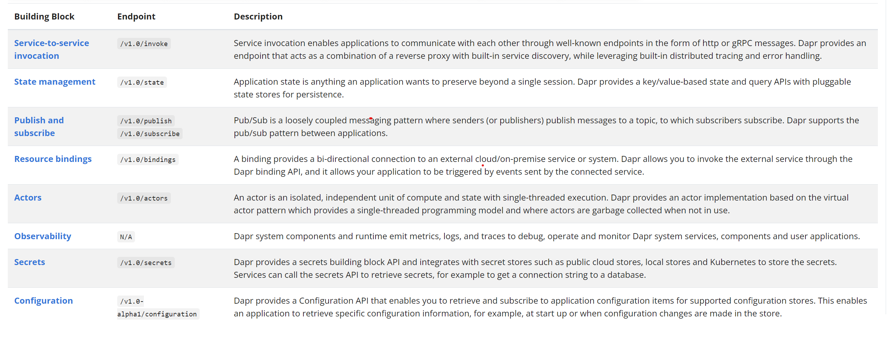

# dapr-spike
Spike code exploring a simple use case with dapr (distributed application runtime)

## dapr concepts


## dapr install 
```bash
wget -q https://raw.githubusercontent.com/dapr/cli/master/install/install.sh -O - | /bin/bash
```

## init
This will pull the required dapr binaries via Docker images and run as a container
```bash
dapr init
```
Verify install with
```bash
dapr -v
```
Verify components directory initialized with
```bash
ls $HOME/.dapr
bin  components  config.yaml # expected output
```

## service invocation
### server 
#### run dapr sidecar on server
```bash
dapr run --app-id hello-world-server --app-port 3001 --dapr-http-port 3500 npm run start:server
```

#### invoke server endpoint via dapr sidecar
```bash
curl http://localhost:3500/v1.0/invoke/hello-world-server/method/api/v1/message
{"message":"Hello World!"}
```

### client
#### run dapr sidecar on client
```bash
dapr run --app-id hello-world-client --app-port 3002 --dapr-http-port 3501 npm run start:client
```

#### invoke client endpoint via dapr sidecar
```bash
curl http://localhost:3501/v1.0/invoke/hello-world-client/method/fetch-message
{"message":"Hello World!","originAppId":"hello-world-server"}
```

## state management
TODO

## pub/sub
TODO

## secrets
TODO